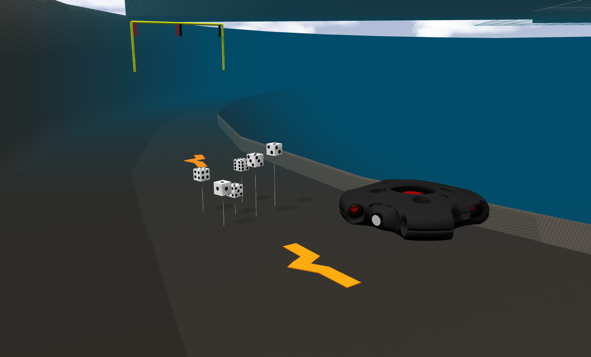

## Vortex NTNU, Manta AUV repository



## Prerequisites

Linux distributions such as Wily (Ubuntu 15.10), Xenial (Ubuntu 16.04) and Jessie (Debian 8)<br />
C++ 11 compiler or newer

## 1. Install ROS kinetic for Ubuntu (If you do not have it already) ##

###### This should take no more than 3 minutes. If you have another version of linux but Ubuntu, follow this guide: http://wiki.ros.org/kinetic/Installation. It is very important that you follow the installation guide and instructions on how to run the guide EXACTLY as stated or you will get running errors. Simply copy and paste the commands to your terminal command window ######

Robot operating system (ROS) provides services designed for heterogeneous computer cluster such as hardware abstraction, low-level device control, implementation of commonly used functionality, message-passing between processes, and package management. The main ROS client libraries (C++, Python, and Lisp) are geared toward a Unix-like system, primarily because of their dependence on large collections of open-source software dependencies.


-------------------------

1. Setup your computer to accept software from packages.ros.org:
	```bash
	$ sudo sh -c 'echo "deb http://packages.ros.org/ros/ubuntu $(lsb_release -sc) main" > /etc/apt/sources.list.d/ros-latest.list'
	```

2. Set up your keys:
	```bash
	$ sudo apt-key adv --keyserver hkp://ha.pool.sks-keyservers.net:80 --recv-key 421C365BD9FF1F717815A3895523BAEEB01FA116
	```

3. Update:
	```bash
	$ sudo apt-get update
	```

4. Installation:
	```bash
	$ sudo apt-get install ros-kinetic-desktop-full
	```

5. Before you can use ROS, you will need to initialize rosdep:
	```bash
	$ sudo rosdep init
	$ rosdep update
	```


6. Environment setup:
	```bash
	$ echo "source /opt/ros/kinetic/setup.bash" >> ~/.bashrc
	$ source ~/.bashrc
	```

## 2. Install the protobuf library, which is used as interface to Gazebo. ##

1. Install the protobuf library, which is used as interface to Gazebo:
	```bash
	$ sudo apt-get install protobuf-compiler
	```

2. Install tf. tf is a package that lets the user keep track of multiple coordinate frames over time:
	```bash
	$ sudo apt-get install ros-kinetic-message-to-tf
	```

## 3. Now that you have ROS Kinetic installed. Create ROS workspace ##
###### This is necessary to be able to run the simulation package that I have created

1. creating a catkin workspace:
	```bash
	$ mkdir -p ~/manta_ws/src
	$ cd ~/manta_ws/src
	$ catkin_init_workspace
	```

2. building the workspace created:
	```bash
	$ cd ~/manta_ws/
	$ catkin build
	```

3. source the current workspace:
	```bash
	$ echo "source manta_ws/devel/setup.bash" >> ~/.bashrc
	```

3. close the current window.

4. Open a new window. To make sure the workspace is properly overlayed:
	```bash
	$ echo $ROS_PACKAGE_PATH
	  /home/youruser/manta_ws/src:/opt/ros/kinetic/share
	```


## 4. How to run the simulation ##

1. Enter the folder where you want to clone the repostory:
	```bash
	$ cd manta_ws/src
	```

2. Clone the repository:
	```bash
	$  git clone https://github.com/vortexntnu/Manta-AUV.git
	```
Ps. You can also manually download the zip-folder in the up-right corner and extract the file <br />
inside the src-folder of you workspace

3. Compile the code by running "catkin build" inside the workspace:
	```bash
	$ cd ~/manta_ws/
	$ catkin build
	```

4. Open a window and run Gazebo world:
	```bash
	$ roslaunch uuv_descriptions robosub_world.launch
	```

5. Open a second window and and spawn the model:
	```bash
	$ roslaunch manta_description upload_manta.launch
	```

6. Open a third window and and launch the thruster_manager.
	```bash
	$ roslaunch manta_thruster_manager thruster_manager.launch
	```
## 5. Open Camera view ##

```bash
$ rqt
```
## 6. Start the controller ##

1. Open a fourth and final window, and run the following line to start the simulation:
	```bash
	$ roslaunch vortex pc.launch
	```

2. Use Xbox controller
